This repository documents the process of how I hacked a generic Chinese drone to automate it with OpenCV and YOLOv8 (Python).


## "Lab" setup
First step was to fire up the drone in its default environment, which means its base setup:  
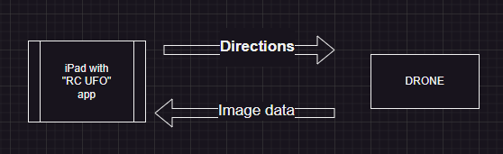

## Getting the camera streams
In a second time, we want to get the image data; my first thought was to sniff the packets sent between the iPad and the drone, so I wanted to connect to the drone wifi:  
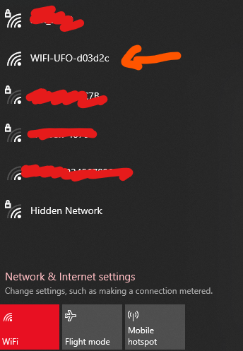

But here's the first challenge: only one device can connect to the drone, the rest will get an error while trying to connect. So we can establish this "map" (lol) of the network — these IPs are static and can't change:  
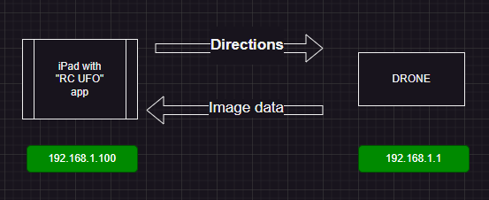

After trying many things to enter the network to sniff the packets, I came across this [Apple Developer documentation page](https://developer.apple.com/documentation/network/recording-a-packet-trace), which basically teaches us that the binary `rvictl` on MacOS lets you "mirror" an Apple mobile device's network communications on an rvi0 interface:  
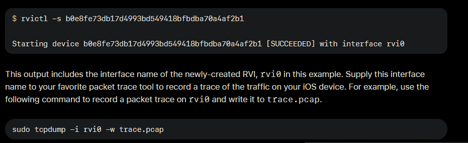

Unlike many people, I do not own an Apple laptop, so I found [this GitHub repo](https://github.com/gh2o/rvi_capture) that basically does the same but for Linux and Windows:  
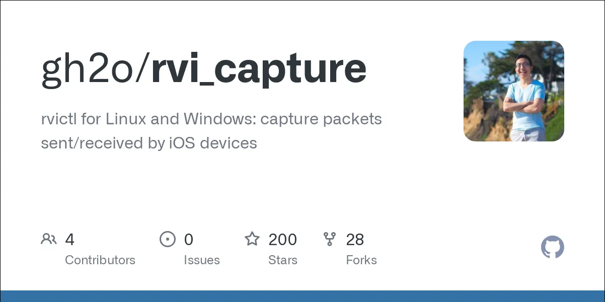

After making sure we have the proper setup (*iTunes installed and Apple Mobile Device support running*) to run the tool, we can create a `pcapng` file to later read with [Wireshark](https://www.wireshark.org/):

```powershell
& "C:/Python/Python310/python.exe" rvi_capture --udid "[apple device udid]" <output>
```

This command gives us a network capture file that has the info we need to understand the drone's anatomy:  
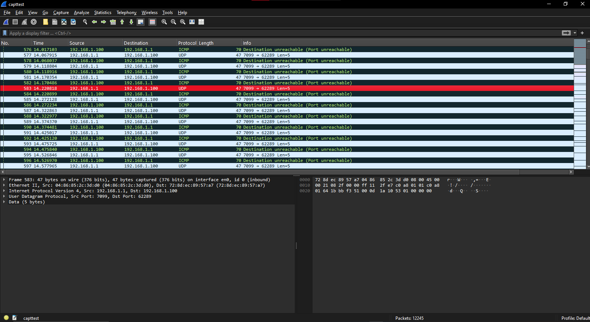

Once opened in Wireshark, we can see a bunch of irrelevant ICMP/UDP traffic between the drone and the iPhone. After a little bit of random and general exploration of the packets, I found a very interesting conversation between the drone and the iPhone:  
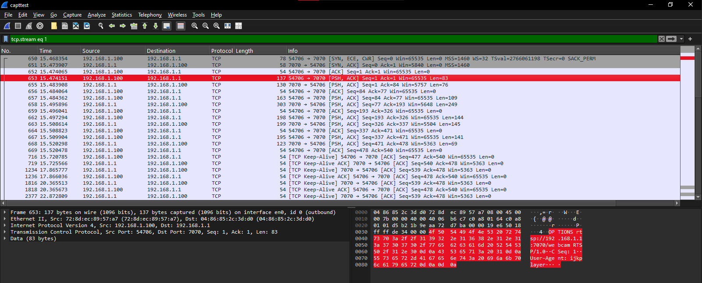

We'll follow this TCP stream to see the full conversation between the two hosts:  
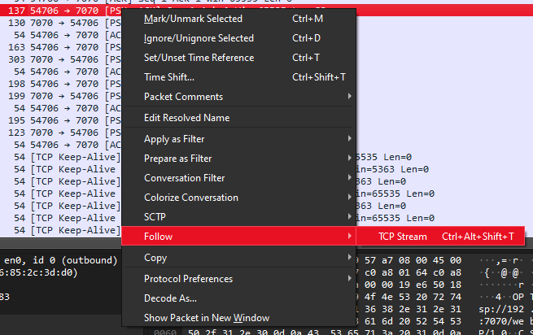  
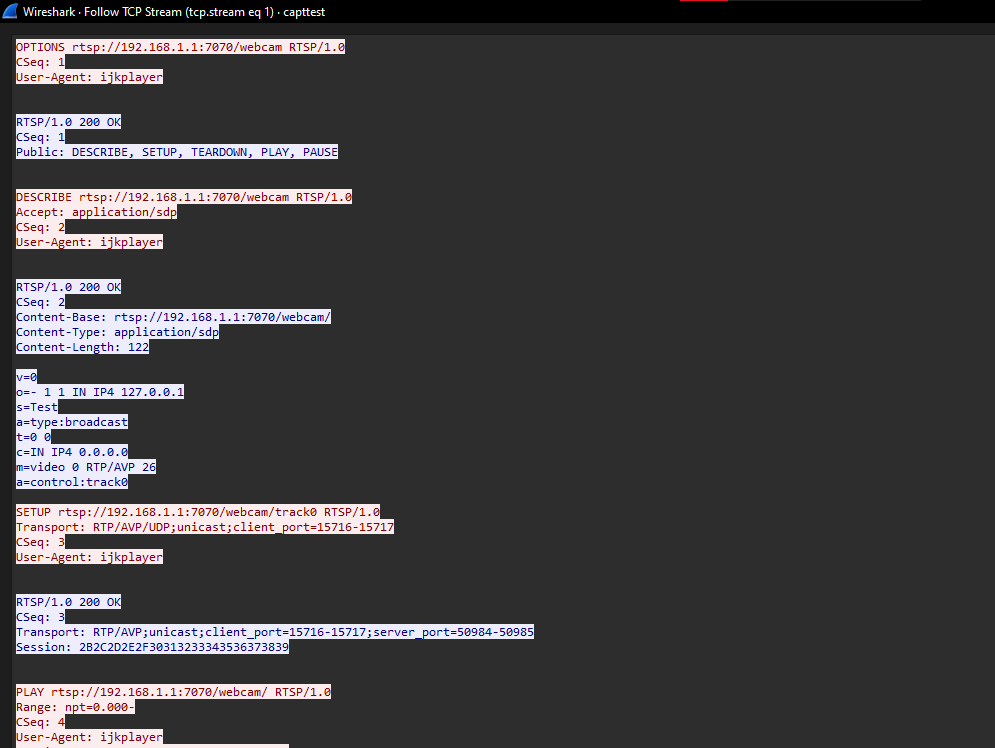

In this very first TCP stream we can observe a lot of notable things:

1. **The video from the drone is sent via RTSP protocol**  
   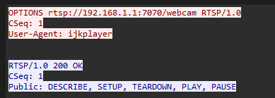

   In the request, the Apple device uses method OPTIONS on `rtsp://192.168.1.1:7070/webcam` using RTSP 1.0.  
   The server (drone) answers with possible methods.  
   Here's a rough explanation of each method:
   
   - `DESCRIBE` → Requests details about the media stream.
   - `SETUP` → Establishes a session and prepares the media stream.
   - `PLAY` → Starts or resumes delivery of the media stream.
   - `PAUSE` → Temporarily halts the media stream without ending the session.
   - `TEARDOWN` → Terminates the session and releases resources.

2. **We also get some info about the video details of the stream**  
   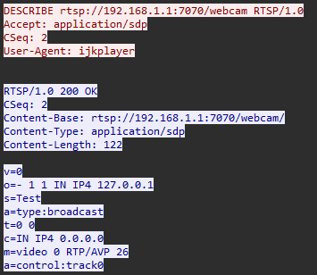

   - This is request #2 and the payload is an SDP file (Session Description Protocol).
   - Session name is "Test" (which is wild since these drones were commercially sold lol).
   - The stream is public (broadcast), not private.
   - `m=video 0 RTP/AVP 26` → media type info.

3. **The server gives the iPhone what looks like a session ID/token**  
   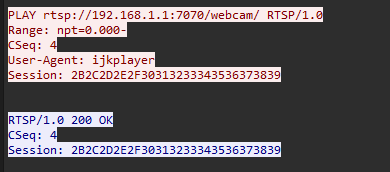 

Using the data listed above I concluded that I can access the RTSP stream using [`ffmpeg`](https://ffmpeg.org/), which is a really popular tool. We also can access the stream using [`OpenCV(-python)`](https://pypi.org/project/opencv-python/) in python.

How to open the stream using ffmpeg : 

```powershell
ffmpeg -rtsp_transport udp -i rtsp://192.168.1.1:7070/webcam
```

Sample python script to open the stream + detect people using YOLOv8 nano (for better performance) :

> Note : For some reason the camera stream is rotated 90° to the right so i added in a setting to decide wether or not rotate it

```python
import cv2
import torch
from ultralytics import YOLO

# --- SETTINGS ---
ROTATE_90 = True   # Set True to rotate 90 degrees to the right
SCALE_PERCENT = 300  # 300% = 3x size
CAMERA_SOURCE = "rtsp://192.168.1.1:7070/webcam"   # 0 for default webcam OR your RTSP link

# --- LOAD MODEL ---
model = YOLO('yolov8n.pt')  # Nano model (FAST AF)

# --- SETUP CAMERA ---
cap = cv2.VideoCapture(CAMERA_SOURCE)

# --- MAIN LOOP ---
while True:
    ret, frame = cap.read()
    if not ret:
        print("[!] Failed to grab frame")
        break

    # Optional Rotate
    if ROTATE_90:
        frame = cv2.rotate(frame, cv2.ROTATE_90_CLOCKWISE)

    # Run YOLO detection
    results = model(frame, verbose=False)[0]

    for box in results.boxes:
        cls = int(box.cls[0])
        conf = float(box.conf[0])
        x1, y1, x2, y2 = map(int, box.xyxy[0])

        # Filter: Only 'person' class (class 0 in COCO)
        if cls == 0 and conf > 0.5:
            label = "Person"
            color = (0, 255, 0)

            # Draw box and label
            cv2.rectangle(frame, (x1, y1), (x2, y2), color, 2)
            cv2.putText(frame, label, (x1, y1 - 10),
                        cv2.FONT_HERSHEY_SIMPLEX, 0.9, color, 2)

    # Resize 3x
    width = int(frame.shape[1] * SCALE_PERCENT / 100)
    height = int(frame.shape[0] * SCALE_PERCENT / 100)
    resized_frame = cv2.resize(frame, (width, height), interpolation=cv2.INTER_LINEAR)

    # Show
    cv2.imshow('People Detection', resized_frame)

    # Break on ESC
    if cv2.waitKey(1) == 27:
        break

cap.release()
cv2.destroyAllWindows()
# --- END OF CODE ---
```

## Understanding the drone controls

Now, it's time to understand the controls of the drone. 
At first I taught it would be as easy as capturing and replaying packets but this didn't work, so I did not include the research process. Even tho I won't include the full process here, ill briefly explain what I tried : 

#### Failed Attempts to [Understanding the drone controls]

-> Using Bluestacks 5 to run the "RC UFO" controller app
>> To be fair, Bluestacks may be great for gaming (it's base purpose) but is absolutely trash for anything else, it's also very bloated and has a LOT of ads.

-> Trying to reproduce communications with the drone from the pcap file
>> I wasn't expecting a lot from this especially knowing that i do not have connection details of the app.

-> Replaying the **EXACT same** packets using [Scapy](https://scapy.net/) 
>> Here, I was pretty upset it didn't work because I taught commands would always be the same and would be easy to reproduce, but nope ill have to try harder...

-> Running the app without a drone connected to "filter out" noise generated by the drone advertising itself on it's network.
>> Doesn't emit any packet, pointless BUT gives us the info that for the app to function a handshake has to be established with 192.168.1.1

